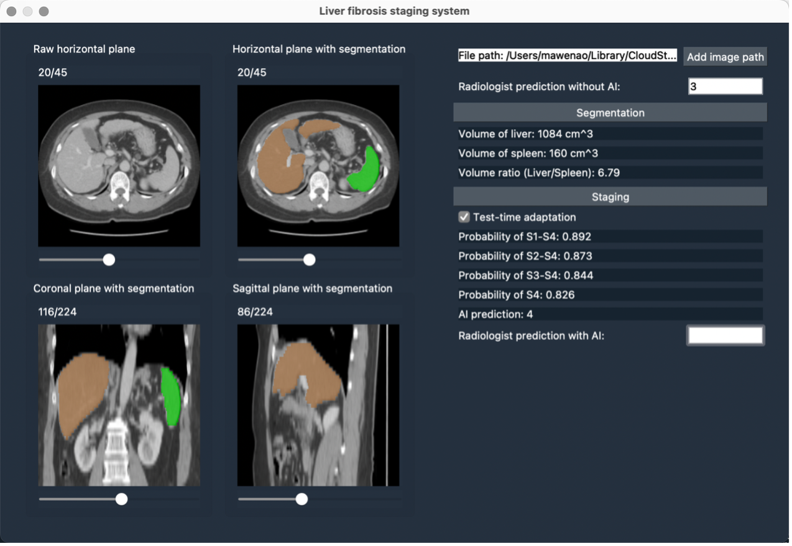

# Introduction

Pytorch implementation for paper **[Deep learning – Radiologist Complementarity Decision System for Liver Fibrosis Staging on CT: A multi-center study](https://github.com/med-air/Efficient-AI-tool-for-liver-fibrosis-staging/)** (under review)

This project includes four folders:
1. data: store the data used in this project (for both segmentation and staging tasks).
2. segmentation: source code for liver and spleen segmentation.
3. staging: source code for liver fibrosis staging.
4. UI: source code for UI development for this AI-assistance system, which integrates both liver & spleen segmentation and liver fibrosis staging models.

We provide an example data for implementations of both segmentation and staging tasks, which is stored in the folder of data. Moreover, we provide a .yaml file to quick setup the environment.


# Setup

### OS Requirements
This AI tool is supported for *Linux* and *Windows*. This AI tool has been tested on the following systems:

+ Linux: Ubuntu 18.04
+ Windows: Windows 10, version 20H2

```bash
Package                Version
---------------------- -------------------
torch                  1.4.0
torchvision            0.5.0
h5py                   3.1.0
opencv-python          4.5.2.52
SimpleITK              2.0.2
scikit-image.          0.17.2
ml-collections         0.1.1
tensorboardx           2.2.0
medpy                  0.4.0
scikit-learn           0.24.2
pandas                 1.1.5
PyQt5                  5.9.2
```

We recommend using conda to quick setup the environment. This takes about 5 min to build. Please use the following commands (in this example we use *Linux*).
```bash 
conda env create -f environment.yaml
conda activate LFSS
```


# Dara preparing

- For the training data of liver and spleen segmentation, put all the raw images (img_raw.nii) and their segmentation ground truths (gt.nii) in the folder "/data/train_seg".
- For the training data of liver fibrosis staging, put all the raw images (img_raw.nii) and their segmentation ground truths (gt.nii) in the folder "/data/train_cls/S*", where "*" denotes each sample's stage of liver fibrosis.
- For the test data, put all the raw images (img_raw.nii) in the folder "/data/test".

The segmentation results (gt.nii) can be generated via our human-in-the-loop strategy. The segmentation networks are based on **[UMMKD](https://github.com/carrenD/ummkd)** and **[TransUNet](https://github.com/Beckschen/TransUNet)**.

Then, all the data can be stored like this:

```bash
.
├── data
    ├──test
       ├── R0001
           ├── img_raw.nii
           └── gt.nii
       ├── R0002
       └──...
    ├──train_cls
       ├── S0
           ├── R0003
               ├── img_raw.nii
               └── gt.nii
           ├── R0004
           └── ...  
       ├── S1
       ├── S2
       ├── S3
       └── S4
    └──train_seg
       ├── R0005
           ├── img_raw.nii
           └── gt.nii
       ├── R0006
       └──...
```


# Segmentation model

### 1. We first perform data preprocessing to resize and normalize data. 

```bash
cd ./segmentation/code
python preprocessing_train.py
python preprocessing_test.py
```

### 2. Then download Google pre-trained ViT models

* [Get models in this link](https://console.cloud.google.com/storage/vit_models/): R50-ViT-B_16, ViT-B_16, ViT-L_16...

```bash
wget https://storage.googleapis.com/vit_models/imagenet21k/{MODEL_NAME}.npz &&
mkdir ./models_save/vit_checkpoint/imagenet21k &&
mv {MODEL_NAME}.npz ./models_save/vit_checkpoint/imagenet21k/{MODEL_NAME}.npz
```

### 3. At last we perform training and testing.

```bash
python train.py
python test.py
```

+ It takes about 3 min to complete both training phase and testing phase on the example data (just 1 sample), while takes about 12 hour to train the model on the training set used in our paper.

# Staging model

### 1. We first perform data preprocessing to crop the region of liver and spleen.

```bash
cd ./staging/code
python preprocessing_train.py
python preprocessing_test.py
```

### 2. And then we perform training and testing.

```bash
python train.py
python test.py
```

+ It takes about 3 min to complete both training phase and testing phase on the example data (just 1 sample), while takes about 1 hour to train the model on the training set used in our paper.


# The AI-assistance software

After training the segmentation and classification models, then you can use the trained model to build an AI-assistance software. The code of UI development is in the folder "UI". You can run the code of AI-assistance software by:

```bash
cd ./UI
python main.py
```

The 3D-image visualization is based on the code **[simpleITK-Snap](https://github.com/JamesQFreeman/simpleITK-Snap)**. The demo of this AI-assistance software can be seen as below:

<p align="center">

</p>


# License
This project is covered under the **Apache 2.0 License**.


# Contact
For any questions, please contact 'wama@cse.cuhk.edu.hk'


